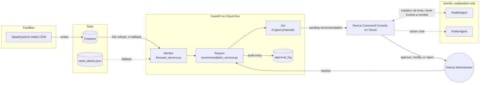

<div align="center">

<br/>

# SwasthyaGrid

### An Agentic District Healthcare Ops Center

**Monitor · Reason · Act · Human Approval**

Built for **Ascendant Agents** (DCODE), Track 07, Open Innovation

<br/>

[](https://nextjs.org/)
[](https://react.dev/)
[](https://fastapi.tiangolo.com)
[](#the-explanation-layer)
[](#data)

<br/>

[](https://swasthyagridai.vercel.app)
[](https://swasthyagrid-api-56144345841.asia-south1.run.app/docs)
[](https://github.com/harshkawatra11/ascend-agents/actions/workflows/ci-cd.yml)

<br/>

[The idea](#the-idea) · [Live deployment](#live-deployment) · [Architecture](#architecture) · [Project structure](#project-structure) · [The moneyshot](#the-moneyshot-a-worked-example) · [Quickstart](#quickstart) · [What's real vs. roadmap](#whats-real-vs-roadmap) · [Demo](#demo)

</div>

---

## The idea

> "The district was rarely short on medicine. It was short on visibility."

District health systems in India run on phone calls, WhatsApp groups, and paper registers. A
shortage that was predictable three days earlier gets discovered the day it becomes a crisis.
SwasthyaGrid is a coordination layer for a district's PHCs and CHCs: it watches every facility,
searches for the best correction when something goes wrong, and proposes it, quantified, scored,
and explained.

**The thesis this whole system is built around: the agent that refuses to act alone is the
better agent for public health.** Every action SwasthyaGrid's agents produce is a *proposal*.
Nothing executes without a human administrator's explicit approval. That is not a missing
feature, it is the product.

```
                 SWASTHYAGRID
             AI HEALTHCARE AGENT
                       │
        ┌──────────────┼──────────────┐
        ↓              ↓              ↓
    MONITOR          REASON          ACT
        │              │              │
   Facilities      Risk engine     Recommendations
   Medicines       Forecasts       Transfers
   Beds            Causes          Redirects
   Doctors         Constraints     Escalations
   Diagnostics
        │              │              │
        └──────────────┼──────────────┘
                       ↓
                HUMAN APPROVAL
                       ↓
                    ACTION
```

---

## Live deployment

| Component | URL | Notes |
|---|---|---|
| Frontend | [swasthyagridai.vercel.app](https://swasthyagridai.vercel.app) | Next.js on Vercel, production alias |
| Backend API | [swasthyagrid-api-56144345841.asia-south1.run.app/docs](https://swasthyagrid-api-56144345841.asia-south1.run.app/docs) | FastAPI on Cloud Run, `asia-south1`, GCP project `swasthya-ai-2026`, scale to zero |
| Repository | [github.com/harshkawatra11/ascend-agents](https://github.com/harshkawatra11/ascend-agents) | Public |
| Data | Served from the bundled `seed_district.json` | Firestore is wired but not yet seeded on this deployment, so the backend runs its own documented fallback path live |

The frontend works even when the backend is cold or unreachable: every screen renders from
bundled mock data within 3 seconds if the API doesn't answer, and `/api/ask` degrades to a
clear "unavailable" message instead of erroring.

---

## Architecture

Three apps, one district:

```
frontend/            Next.js 16, the 12-screen district command console (deployed to Vercel)
backend/              FastAPI, forecasting, recommendation engine, Gemini agents (deployed to Cloud Run)
ai-healthcare-crm/    Next.js 16, facility-side daily data intake portal (local only, see below)
```



### Three agents, mapped to real code, not a diagram for its own sake

| Agent | Owns | Real implementation |
|---|---|---|
| **Monitor** | Facilities, medicines, beds, doctors, diagnostics | `forecast_service.py`, `days_remaining = units_remaining / avg_daily_consumption`, tiered `<3d high / <6d medium / else low`, cascading facility risk |
| **Reason** | Risk engine, forecasts, causes, constraints | `recommendation_service.py`, scans every other facility for surplus, ranks by `(distance_km, surplus)`, scores a confidence formula (below) |
| **Act** | Recommendations, transfers, redirects, escalations | 4 typed proposals: `stock_transfer`, `staff_transfer`, `bed_redirect`, `diagnostic_redirect`. "The engine only ever proposes." is the module docstring |
| **Human Approval → Action** | The gate | `RecommendationService.resolve()` is the **only** function that can move a recommendation out of `pending`. Every resolution is written to an audit trail |

The confidence formula, verbatim from the code. Distance and safety margin actively *penalise*
a risky transfer, so the score can't be gamed by picking any facility with surplus:

```python
factor_score        = min(len(factors) * 10, 30)
logistics_score      = max(0, 20 - distance_km)
safety_margin_score  = 10 if (surplus - quantity) > 0 else 5
confidence = min(round(forecast_confidence * 0.4 + factor_score + logistics_score + safety_margin_score), 99)
```

---

## Project structure

```
ascend-agents/
├── README.md                              this file
├── research-dossier.md                    sourced research behind the pitch deck's claims
├── vercel.json                            monorepo build config, points Vercel at frontend/
├── .github/workflows/ci-cd.yml            lint, test, build on every push/PR
│
├── frontend/                              Next.js 16 command console → Vercel
│   ├── src/app/
│   │   ├── (dashboard)/                   the 12 authenticated screens, one folder per route
│   │   │   ├── overview/                  district KPI strip, map, top alerts, top recommendations
│   │   │   ├── agents/                    the Monitor/Reason/Act console, live activity feed
│   │   │   ├── recommendations/           full recommendation list, approve/modify/reject
│   │   │   ├── inventory/                 medicine stock forecasts
│   │   │   ├── beds/                      bed occupancy forecasts
│   │   │   ├── doctors/                   attendance-risk forecasts
│   │   │   ├── diagnostics/               diagnostic machine status
│   │   │   ├── footfall/                  7-day patient footfall forecast
│   │   │   ├── map/                       district-wide risk map
│   │   │   ├── facilities/                sortable facility roster
│   │   │   ├── analytics/                 causal chains, performance scorecards
│   │   │   └── citizen/                   public-facing citizen chat
│   │   └── api/
│   │       ├── ask/route.ts               proxies to the backend's tool-calling agent, falls back to a direct Gemini call, then to a static message
│   │       └── public-ask/route.ts        citizen chat proxy
│   ├── src/components/
│   │   ├── shell/                         DashboardShell, Sidebar, Topbar, RoleSwitcher, CommandPalette
│   │   ├── ui/                            Toast, Drawer, Skeleton, EmptyState
│   │   ├── AgentConsole.tsx                the 3 agent cards + live activity feed + approval gate banner
│   │   ├── AgentStatusStrip.tsx            compact agent status, shown on Overview
│   │   ├── RecommendationsPanel.tsx        recommendation cards, reasons grouped by agent stage
│   │   ├── AskPanel.tsx                    chat widget, renders the live tool-call trace
│   │   └── ...                             map, charts, alerts, forecasts, performance scorecards
│   ├── src/lib/
│   │   ├── api.ts                         typed fetch client, every call has a graceful mock fallback
│   │   ├── agents.ts                      the agent registry, reasons[] → Monitor/Reason/Act grouping
│   │   ├── store.tsx                      RecommendationsProvider, live facility risk state
│   │   └── roleContext.tsx                district_admin / phc_staff / state_officer capabilities
│   └── src/data/district.ts               bundled mock data, the zero-backend fallback source
│
├── backend/                               FastAPI service → Cloud Run
│   ├── app/
│   │   ├── main.py                        app factory, CORS allowlist, security headers, router mounting
│   │   ├── api/v1/
│   │   │   ├── routes.py                  16 REST endpoints: district, facilities, medicines, beds,
│   │   │   │                              doctors, diagnostics, recommendations, alerts, analytics, audit-log
│   │   │   ├── chat.py                    POST /ask, the admin HealthAgent
│   │   │   ├── public_chat.py             POST /public-ask, the citizen PublicAgent
│   │   │   └── health.py                  GET /health
│   │   ├── agents/
│   │   │   ├── health_agent.py            Gemini tool-calling agent, 7 tools, MAX_TOOL_ITERATIONS = 5
│   │   │   └── public_agent.py            Gemini tool-calling agent, 2 tools, disjoint from HealthAgent
│   │   ├── services/
│   │   │   ├── forecast_service.py        Monitor: risk tiering for medicines, beds, doctors, diagnostics
│   │   │   ├── recommendation_service.py  Reason + Act: the confidence formula, resolve(), the audit log
│   │   │   └── district_service.py        district summary and performance-scorecard aggregation
│   │   ├── repositories/district_repository.py   Firestore-first, JSON-seed-fallback data access, 20s refresh TTL
│   │   ├── tools/
│   │   │   ├── district_tools.py          7 functions exposed to HealthAgent as Gemini tool declarations
│   │   │   ├── emergency_tool.py          rule-engine first-aid guidance for the citizen agent
│   │   │   └── maps_tool.py               Google Places nearby-facility search, with a labelled demo fallback
│   │   ├── schemas/recommendation.py      Pydantic request/response models
│   │   ├── core/                          settings (Pydantic Settings), exceptions, logging
│   │   └── prompts/system_prompt.py       the "explain, never invent a number" system prompt
│   ├── tests/test_health.py               pytest suite, runs in CI (health, recommendations, ask-without-key)
│   ├── data/seed_district.json            the 1-district, 8-facility illustrative dataset
│   ├── scripts/
│   │   ├── deploy.sh                      gcloud builds submit + gcloud run deploy
│   │   ├── setup_secrets.sh               one-time Secret Manager + API enablement
│   │   └── setup_firestore.py             seeds Firestore from the JSON so the CRM and backend share state
│   ├── Dockerfile                         multi-stage, non-root, python:3.12-slim
│   ├── docker-compose.yml                 local container run
│   └── pyproject.toml                     dependencies, Ruff rule set, pytest config
│
└── ai-healthcare-crm/                     Next.js 16 facility intake portal, local only
    ├── src/app/(portal)/dashboard/        facility staff daily reporting UI
    ├── src/app/(portal)/admin/            district admin roster view
    ├── src/app/api/{auth,facility,medicines,beds,doctors,footfall}/   CRUD endpoints, writes to Firestore
    └── src/lib/{firebaseAdmin,session}.ts Firebase Admin SDK + cookie session auth
```

`ai-healthcare-crm/` is gitignored in this repository (it hard-fails without a real Firebase
service account, so it isn't part of the deployable-with-zero-keys guarantee the other two apps
have). It exists on disk for local development; the backend's `DistrictRepository` is what reads
whatever it writes to Firestore, falling back to the JSON seed when Firestore is unreachable or
empty.

---

## The moneyshot, a worked example

**PHC Phagi is down to 4 units of Anti-Snake Venom, consuming 2 per day.**

```
4 units / 2 per day = 2.0 days remaining, HIGH RISK

Search: which other facility stocks ASV?
  CHC North: 80 units, 3 per day, 26.7 days of cover, 48 km away
  surplus above its own 5-day safety stock = 80 - 15 = 65 units

Recommend:
  deficit to 5-day safety stock at PHC Phagi = (2 x 5) - 4 = 6 units
  quantity = min(6, 65) = 6 units

Score:
  factor_score (10) + logistics_score (0, 48km fully discounts it) + safety_margin (10)
  + forecast_confidence 80 x 0.4
  = confidence 52, PENDING ADMINISTRATOR APPROVAL
```

This is the **only** stock-transfer recommendation the engine's real seed data actually
generates today. Every other multi-facility medicine has no facility below the high-risk
threshold, so this isn't cherry-picked. The moderate confidence is the point: the score visibly
discounts a real 48 km supply line instead of rewarding any transfer that "solves" the shortage
on paper. That's what an explainable, non-overconfident recommendation looks like.

---

## The explanation layer

Two Gemini agents sit above the deterministic engine, explanation only, never prediction:

- **`HealthAgent`**, 7 tools bound to Gemini (`get_district_overview`, `get_medicine_stock`,
  `get_recommendations`, `get_causal_chain`, and more), `MAX_TOOL_ITERATIONS = 5`, returns
  `{answer, tool_calls[], confidence}`. The system prompt states the contract directly:

  > "You are read-only: you explain data and reasoning, you never claim to have executed a
  > transfer, approval, or any other action. Recommendations always require a human
  > administrator's approval."

- **`PublicAgent`**, citizen-facing, a disjoint toolset (`get_emergency_guidance`,
  `find_nearby_phc`) so operational authority and public guidance never cross-contaminate.

The `/agents` console in the frontend renders the live `tool_calls[]` trace, "Monitor called
`get_medicine_stock`, Reason called `get_recommendations`", so an administrator can see what
the agent actually looked at before it spoke.

---

## Quickstart

Every screen in the frontend renders from local mock data with **zero backend, zero Firestore,
zero API keys**. `safeFetch()` has a 3-second timeout that falls back to
`frontend/src/data/district.ts`. Start there.

```bash
# Frontend, the 12-screen command console
cd frontend
npm install
npm run dev            # http://localhost:3000

# Backend, forecasting, recommendation engine, Gemini agents
cd backend
python -m venv .venv && .venv\Scripts\activate     # or source .venv/bin/activate
pip install -r requirements.txt
uvicorn app.main:app --reload --port 8080           # docs at http://localhost:8080/docs

# CRM, facility data intake (requires real Firebase credentials, see below)
cd ai-healthcare-crm
npm install
npm run dev
```

### Environment variables

| File | Variable | Required for |
|---|---|---|
| `frontend/.env.local` | `NEXT_PUBLIC_API_BASE` | Pointing the console at the FastAPI backend (defaults to `localhost:8080`) |
| `frontend/.env.local` | `GEMINI_API_KEY` | The `/api/ask` route's direct-Gemini fallback (only used if the backend is unreachable) |
| `backend/.env` | `GEMINI_API_KEY` | `HealthAgent` / `PublicAgent` tool-calling |
| `backend/.env` | `GEMINI_MODEL` | Model override (defaults to `gemini-3.5-flash-lite`) |
| `backend/.env` | `GOOGLE_MAPS_API_KEY` | Real nearest-PHC lookups (falls back to labelled `[DEMO DATA]` without it) |
| `backend/.env` | `GOOGLE_CLOUD_PROJECT`, `USE_SECRET_MANAGER` | Firestore + Secret Manager in production |
| `ai-healthcare-crm/.env.local` | `FIREBASE_SERVICE_ACCOUNT` | Base64 service-account JSON, the CRM hard-fails without it |
| `ai-healthcare-crm/.env.local` | `SESSION_SECRET` | 64-hex JWT signing secret |

None of these are required to run the frontend and see the full agent loop end to end.

### Deploying it yourself

```bash
# Backend → Cloud Run
cd backend
GCP_PROJECT_ID=<your-project> bash scripts/setup_secrets.sh   # one-time: enables APIs, stores GEMINI_API_KEY
GCP_PROJECT_ID=<your-project> bash scripts/deploy.sh           # builds and deploys

# Frontend → Vercel
cd frontend
vercel link --yes --project <your-project-name>
vercel env add NEXT_PUBLIC_API_BASE production   # paste the Cloud Run URL
vercel --prod --yes
```

---

## What's real vs. roadmap

Honesty over hype. This is exactly what's built today, and exactly what isn't.

**Built:**
- Deterministic Monitor → Reason → Act pipeline, verified against live seed data (the worked
  example above came from the running engine, not a slide)
- Hard-coded human approval gate, `resolve()` is the only state-transition path in the codebase
- Persisted approval audit trail (Firestore, with an in-memory fallback)
- Two Gemini tool-calling agents with a disjoint admin/citizen toolset
- Graceful degradation to zero-backend mock data on every screen
- A CRM app for real facility-side data intake
- CI on every push: Ruff lint, pytest, frontend build
- Live deployment: Vercel (frontend) and Cloud Run (backend)

**Roadmap, not built:**
- A scheduler for autonomous Monitor runs, today it's pull-on-read with a 20-second TTL, not a
  background job
- No SSE/websocket, the agent console polls, it doesn't stream
- No government data integration yet (HMIS/IDSP/ABDM), seed data models one illustrative
  district (Jaipur Rural, Rajasthan; 8 facilities)
- No ML forecasting, the service interface (`{value, confidence, factors[]}`) is designed so a
  trained model can slot in later without changing callers
- Firestore isn't seeded on the live deployment yet, so the backend is currently serving from
  the bundled JSON seed there too

Full research and argument behind the deck: [`research-dossier.md`](./research-dossier.md).

---

## Demo

- **Video:** _add the 3 to 4 minute demo video link here_
- **Deck:** _add the Figma Slides link here_
- **Repo:** [github.com/harshkawatra11/ascend-agents](https://github.com/harshkawatra11/ascend-agents)
- **Live app:** [swasthyagridai.vercel.app](https://swasthyagridai.vercel.app)

---

<div align="center">

Built by Harsh Kawatra, Anuj Gambhir, Gursimran Kaur, Dayita Arora

</div>
